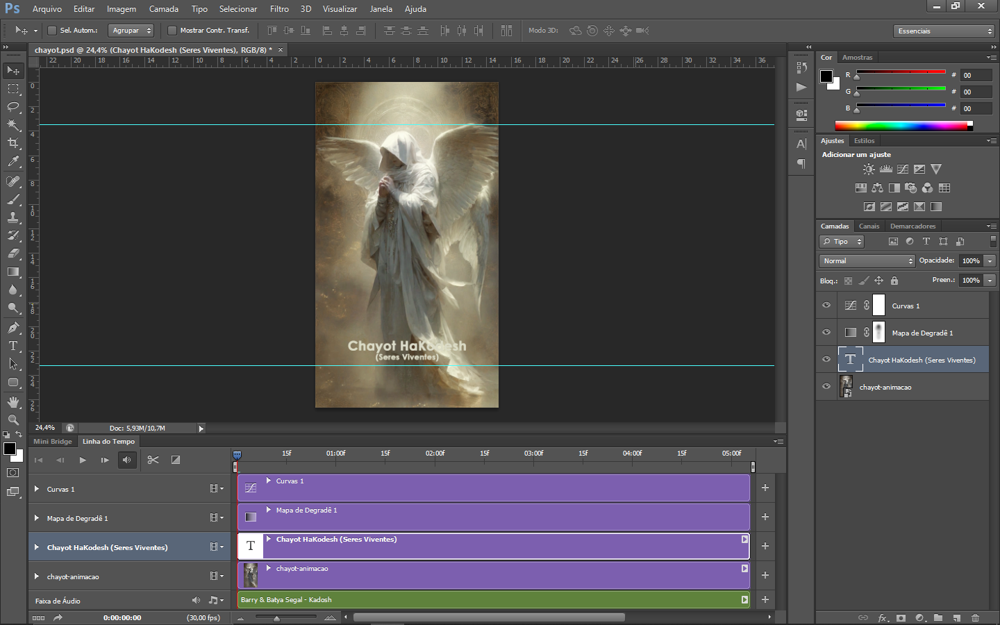

# 👼 Chayot HaKodesh — 2026

## 📒 Descrição

**Chayot HaKodesh** é um projeto audiovisual experimental criado com o uso de Inteligência Artificial Generativa.

A proposta inicial foi simples:

> **Um anjo trazendo 2026.**

A partir dessa ideia, a Meta AI gerou uma figura angelical com **quatro asas, organizadas em dois pares**. Essa característica visual acabou inspirando o nome **Chayot HaKodesh**, referência às criaturas celestiais descritas na tradição judaica.

O projeto combina geração de imagem por IA, animação, edição digital e trilha sonora para criar uma experiência audiovisual curta.

---

## 🤖 Tecnologias Utilizadas

* **Meta AI** — geração da imagem e animação.
* **Adobe Photoshop** — edição e pós-produção.
* **GitHub** — documentação e versionamento do projeto.

### 🎵 Trilha sonora

**Kadosh — Barry & Batya Segal**

A música é utilizada como trilha sonora do vídeo final e é creditada aos seus respectivos autores.

---

## 🧐 Processo de Criação

### 1. Conceito

A ideia inicial foi criar uma representação visual de um anjo trazendo o ano de **2026**.

O prompt utilizado foi simples:

> **"Um anjo trazendo 2026."**

A intenção foi permitir que a Inteligência Artificial interpretasse livremente a proposta visual.

### 2. Geração da imagem

A imagem foi criada utilizando a **Meta AI**.

Durante a geração, a IA produziu uma figura angelical com **quatro asas, formando dois pares**.

Esse elemento visual inesperado tornou-se parte central da identidade do projeto e levou à escolha do nome **Chayot HaKodesh**.

### 3. Animação

A imagem gerada foi posteriormente animada utilizando o recurso de animação de imagem da **Meta AI**, disponível no momento em que o projeto foi produzido.

A disponibilidade e as condições de uso dos recursos da ferramenta podem mudar ao longo do tempo.

### 4. Pós-produção

Após a geração e animação, o material foi levado ao **Adobe Photoshop** para edição e pós-produção.

Foram realizados ajustes e tratamentos no material antes da composição do resultado final.

### 🎨 Processo de edição

Abaixo, uma captura do arquivo de produção aberto no Photoshop:

### 5. Resultado final

O projeto foi finalizado como um vídeo audiovisual curto, combinando:

**Imagem gerada por IA → Animação → Photoshop → Trilha sonora → Vídeo final**

---

## 🚀 Resultado

### 🎬 Chayot HaKodesh — 2026

O resultado final é um vídeo que representa visualmente a chegada de **2026 através de uma figura angelical criada com auxílio de Inteligência Artificial Generativa**.

### Arquivos do projeto

* 🖼️ Imagem gerada pela IA
* 🎬 Animação
* 🎨 Arquivo de produção `.PSD`
* 🖥️ Captura do processo de edição no Photoshop
* 🎥 Vídeo final

---

## 💭 Reflexão

O aspecto mais interessante do processo foi perceber como uma ideia extremamente simples pode ganhar características inesperadas quando interpretada por uma IA generativa.

O prompt inicial não especificava quatro asas. Esse elemento surgiu durante a geração e acabou influenciando a interpretação artística e o próprio nome do projeto.

Isso demonstra uma característica interessante da criação com IA: o resultado não é necessariamente apenas a execução literal de uma instrução, mas também uma interação entre **intenção humana, interpretação da IA e pós-produção criativa**.

---

## 📚 Sobre o desafio

Este projeto foi desenvolvido como parte do **Lab "Natty or Not" da DIO**, cujo objetivo é explorar as possibilidades das Inteligências Artificiais Generativas na criação de conteúdos.

A proposta foi utilizar IA como parte de um processo criativo completo:

**Ideia → IA Generativa → Animação → Pós-produção → Resultado Audiovisual**

---

## 👼 Chayot HaKodesh

**Um anjo trazendo 2026.**
